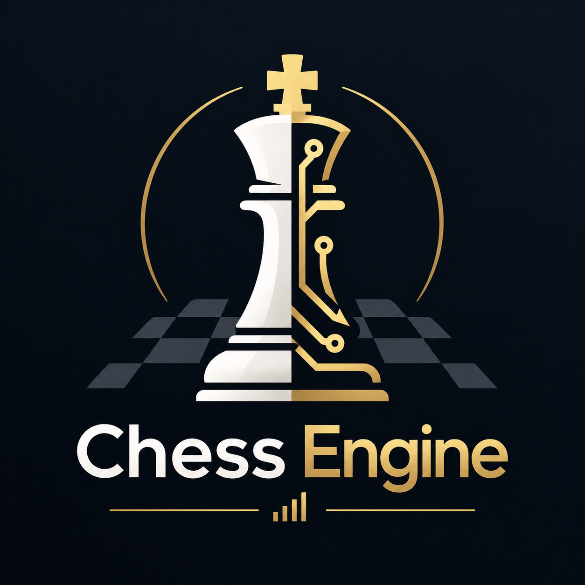
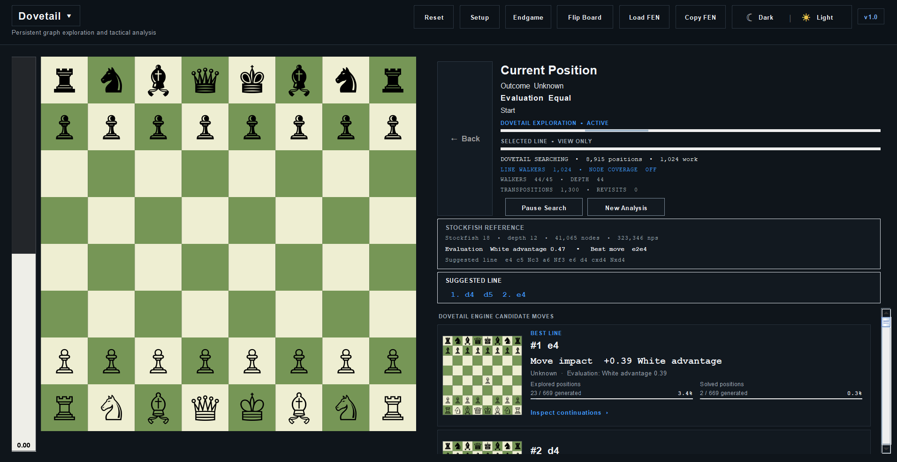
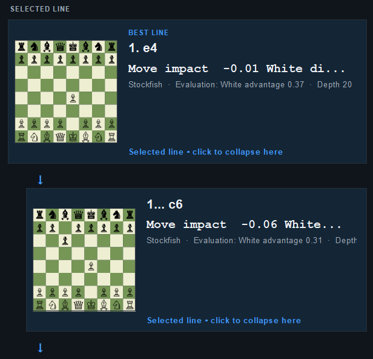
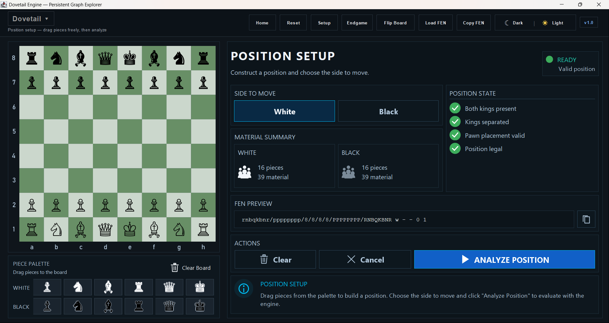
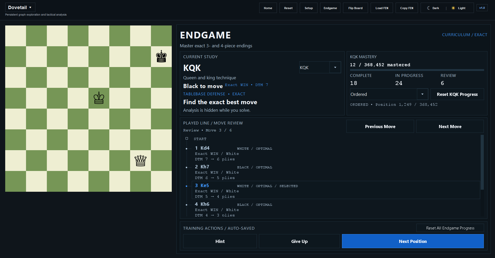

# Chess Engine

[](https://github.com/ShaiBeekman/Chess-Engine/releases/latest)

[](LICENSE)
[](https://github.com/ShaiBeekman/Chess-Engine/releases/download/v1.0.3/Chess-Engine-v1.0.3-windows.zip)

<p align="center">
  
</p>

**A Java chess engine built around persistent graph exploration, exact endgame solving, and interactive analysis.**

Unlike a conventional engine centered on a single minimax search tree, this project explores chess positions through a shared canonical `PositionGraph`. Multiple persistent line walkers can encounter the same position from different move orders and reuse the same graph node, allowing transpositions, visit counts, solved-state propagation, and analysis history to accumulate over time.

<p align="center">
  
</p>

## Highlights

- **Persistent canonical position graph** with transposition reuse rather than independent per-line trees.
- **Dovetail search** using a countable diagonal schedule of persistent walkers.
- **Hybrid search** combining the same walker schedule with fair node/edge coverage.
- **Strength-aware stochastic exploration** that preserves novelty and anti-repeat behavior while biasing tied choices toward stronger moves.
- **Full legal chess rules**, including castling, en passant, promotion, check, checkmate, stalemate, repetition, and move-count draw rules.
- **Interactive analysis UI** with candidate lines, board previews, continuation navigation, keyboard navigation, board flipping, and light/dark modes.
- **Optional Stockfish 18 reference analysis** through a dependency-free UCI client.
- **Position Setup mode** with free piece placement, side-to-move controls, material summary, live FEN output, undo/redo navigation, and arbitrary-position analysis.
- **Exact 3- and 4-piece endgame solving** backed by generated tablebases.
- **30 canonical four-piece material families** validated by the v1.0 release regression suite.
- **Endgame Curriculum** with exact WDL/DTM feedback, ordered/randomized practice, hints, progress tracking, and adjustable practice strength.
- **Formal v1.0 regression gate** covering core chess rules, search, tablebases, endgame control, Stockfish integration, and packed-runtime memory behavior.

## Analysis Modes

### Dovetail

Dovetail is the project's original exploration model. Persistent walkers are scheduled diagonally:

```text
A1
B1, A2
C1, B2, A3
D1, C2, B3, A4
...
```

Each walker can continue for up to 10,000 half-moves. Walkers write into one shared `PositionGraph`, so transpositions discovered by different walks collapse onto the same canonical node.

Move selection prioritizes exploration first:

1. lower walker-specific edge usage,
2. lower total edge traversals,
3. lower target-node visits,
4. a strong penalty for revisiting a position already on the current walk.

Evaluation is used only among moves tied at the best exploration penalty. Four repeating walker profiles provide different amounts of chess bias: `EXPLORER`, `GUIDED`, `STRONG`, and `PRINCIPAL`. Every fourth walker therefore remains a pure explorer.

### Hybrid

Hybrid preserves the exact same Dovetail walker schedule and adds a second lane for **fair persistent node/edge coverage**.

The coverage queue determines *which node* receives work. Evaluation only selects the strongest currently unvisited move *within that already-selected node*. This separation prevents attractive regions of the graph from turning the global scheduler into a best-first queue and starving the rest of the explored graph.

## Stockfish Reference and Continuations

Stockfish is intentionally separate from the native graph search. The application uses it as an optional UCI reference engine for comparison, calibration, MultiPV candidate analysis, and continuation inspection.

<p align="center">
  
</p>

The native Dovetail/Hybrid engine remains its own search system; Stockfish does not drive the persistent graph exploration.

## Position Setup

Setup mode can construct arbitrary positions directly on the board. The interface tracks material, validates the position, generates live FEN output, and can send the resulting position directly into analysis.

<p align="center">
  
</p>

Setup-created positions intentionally begin without castling rights unless those rights are supplied through a loaded FEN.

## Exact Endgames

The endgame subsystem combines generated exact tablebases with an interactive curriculum.

<p align="center">
  
</p>

v1.0 includes exact 3-piece support and a completed 30-family canonical four-piece catalog. The solver routes supported positions to exact WDL/DTM data and the curriculum turns those results into practice positions.

The `KP-KP` tablebase includes en-passant-aware state handling. Its v1.0 packed runtime representation stores WDL and DTM in one byte per indexed state, reducing the core state array from roughly **96.3 MiB to 32.11 MiB**. The release regression suite verifies the packed runtime in an isolated JVM limited to `-Xmx128m`.

Five-piece and larger tablebases are outside the v1.0 scope.

## Windows Quick Start

Download `Chess-Engine-v1.0.3-windows.zip`, extract the **complete ZIP**, and double-click
**`Chess Engine.exe`**. Java 26 is bundled; no separate Java or Maven installation
is needed. Keep `app/`, `runtime/`, and `tablebases/` beside the EXE. Stockfish is
optional; place its executable in the adjacent `stockfish/` folder.

v1.0.3 is a performance-maintenance release. Early manual moves update the board
and history immediately while background analysis continues, then join the same
persistent position graph. Analysis updates wait for active piece gestures to
finish; palette dragging and first-use Setup rendering also receive responsiveness
fixes. Automatic analysis, chess rules, and search behavior are preserved.

## Build and Run

### Requirements

- **JDK 26** — the v1.0 release candidate was built and verified on OpenJDK 26.
- **Apache Maven 3.9+** for the command-line build.
- **Stockfish 18** is optional and is not stored in this Git repository.
- Generated tablebase binaries are also distributed separately from the source repository because of their size.

### Maven

From the repository root:

```bash
mvn clean package
```

Run the application:

```bash
java -jar target/chess-engine-1.0.3.jar
```

The application can also be launched directly from IntelliJ with:

```text
main.java.chess.Main
```

### Build the Windows application image

On Windows x64, with Maven and JDK 26, use the verified original tablebase archive
listed in [Runtime Assets](docs/RUNTIME-ASSETS.md):

```powershell
powershell -NoProfile -ExecutionPolicy Bypass -File .\package-windows.ps1 -JdkHome $env:JAVA_HOME -TablebaseArchive .\Chess-Engine-v1.0.0-tablebases.zip
```

This runs a clean build, derives runtime modules using `jdeps`, bundles Java with
`jlink`, and creates the icon-branded launcher using `jpackage --type app-image`.
Output: `target/windows-v1.0.3/Chess Engine/Chess Engine.exe` and
`target/Chess-Engine-v1.0.3-windows.zip`. The JAR is internal; launch the EXE.

### Configure Stockfish

The UCI client looks for Stockfish automatically in several common project/user locations. For an explicit path, use either the JVM property:

```bash
java -Dstockfish.path="/full/path/to/stockfish" -jar target/chess-engine-1.0.3.jar
```

or the environment variable:

```text
STOCKFISH_PATH
```

On PowerShell, for example:

```powershell
$env:STOCKFISH_PATH="C:\path\to\stockfish-windows-x86-64-avx2.exe"
java -jar target\chess-engine-1.0.3.jar
```

See [`docs/RUNTIME-ASSETS.md`](docs/RUNTIME-ASSETS.md) for tablebase and Stockfish details.

## v1.0 Release Verification

The release candidate has a dedicated automated regression entry point:

```text
main.java.chess.release.V1ReleaseRegressionMain
```

M87 runs each subsystem gate in a fresh JVM so caches and state cannot leak between tests.

| Gate | Result | Recorded time |
| --- | ---: | ---: |
| Core chess / graph / FEN | PASS | 5.394 s |
| M76 Dovetail frozen search | PASS | 11.625 s |
| M77 Hybrid frozen search | PASS | 94.981 s |
| Three-piece packaged tablebases | PASS | 0.597 s |
| 30-family four-piece catalog | PASS | 198.667 s |
| Endgame move controller / practice strength | PASS | 14.980 s |
| Stockfish process / forced-mate smoke | PASS | 2.241 s |
| M86 KPKP packed runtime / 128-MiB heap | PASS | 19.200 s |

**8 / 8 automated gates passed** in **347.700 seconds**, followed by the manual GUI smoke check used to sign off the v1.0 interface.

For more detail, see [`docs/RELEASE-VERIFICATION.md`](docs/RELEASE-VERIFICATION.md).

## Project Structure

```text
src/main/java/chess/
├── analysis/      analysis models and presentation support
├── endgame/       exact tablebases, builders, codecs, services, curriculum
├── engine/        engine coordination and endgame move control
├── evaluation/    native position evaluation
├── gui/           Swing application and interactive analysis UI
├── model/         board, pieces, moves, positions, FEN/state models
├── release/       v1.0 release regression gate
├── rules/         legal move generation, attacks, game-state evaluation
├── search/        PositionGraph, Dovetail walkers, Hybrid scheduler
├── stockfish/     dependency-free UCI integration and formatting
└── tests/         verification and regression harnesses
```

The repository intentionally retains many tablebase builders, validation mains, and diagnostic harnesses. They form part of the reproducible development history for the exact endgame subsystem and release gates.

## Architecture

A deeper technical description of the graph model, search lanes, and endgame stack is available in [`docs/ARCHITECTURE.md`](docs/ARCHITECTURE.md).

## Scope

This project is primarily an exploration of **search architecture, graph persistence, exact endgame computation, and interactive analysis**. It is not presented as a replacement for state-of-the-art alpha-beta engines in raw playing strength. Stockfish is included as an external reference precisely so the native system can be compared against a mature conventional engine.

## Third-Party Software

Stockfish is a separate optional executable and is **not included in this source repository**. Stockfish is distributed under the GNU General Public License version 3. See [`THIRD_PARTY_NOTICES.md`](THIRD_PARTY_NOTICES.md).

## Author

**Shai Beekman**

- GitHub: [ShaiBeekman](https://github.com/ShaiBeekman)
- Portfolio: [shaibeekman.github.io](https://shaibeekman.github.io)
